# DONATION SYSTEM TECHNICAL ANALYSIS

## Document Purpose

Complete reverse-analysis of the donation system based on actual codebase implementation. No assumptions, no improvements - only documented behavior.

---

# 1. FULL SYSTEM REVERSE ANALYSIS

## 1.1 Controllers Layer

| Controller               | Prefix           | Key Endpoints                      |
| ------------------------ | ---------------- | ---------------------------------- |
| DonationsController      | /donations       | POST, GET, payment-status, webhook |
| WebhookController        | /webhooks        | POST myfatoora                     |
| PaymentMethodsController | /payment-methods | GET available, health              |

## 1.2 Services Layer

| Service                      | Responsibility | Key Methods                                          |
| ---------------------------- | -------------- | ---------------------------------------------------- |
| DonationsService             | Orchestration  | create(), handlePaymentWebhook(), reconcilePayment() |
| PaymentService               | Gateway        | createPayment(), getPaymentStatus()                  |
| DonorsService                | Resolution     | resolveOrCreate()                                    |
| OutboxService                | Events         | createEvent(), markAsProcessed()                     |
| PaymentReconciliationService | Recovery       | handleStuckEvents()                                  |

## 1.3 Repository Layer

- DonationRepository: donations CRUD
- PaymentRepository: payments CRUD
- DonorRepository: donors CRUD
- ProjectRepository: update only (increment)
- CampaignRepository: update only (increment)

## 1.4 Entities

```
Donation { id, donorId, paymentId, projectId, campaignId, status, amount, currency }
Payment { id, transactionId, mfPaymentId, status, amount }
Donor { id, userId, email, fullName, isAnonymous }
Project { id, title, targetAmount, currentAmount, donationCount }
Campaign { id, title, targetAmount, currentAmount, donationCount }
OutboxEvent { id, eventType, payload, status, retryCount }
```

---

# 2. SYSTEM ARCHITECTURE DIAGRAM

## 2.1 High-Level Architecture

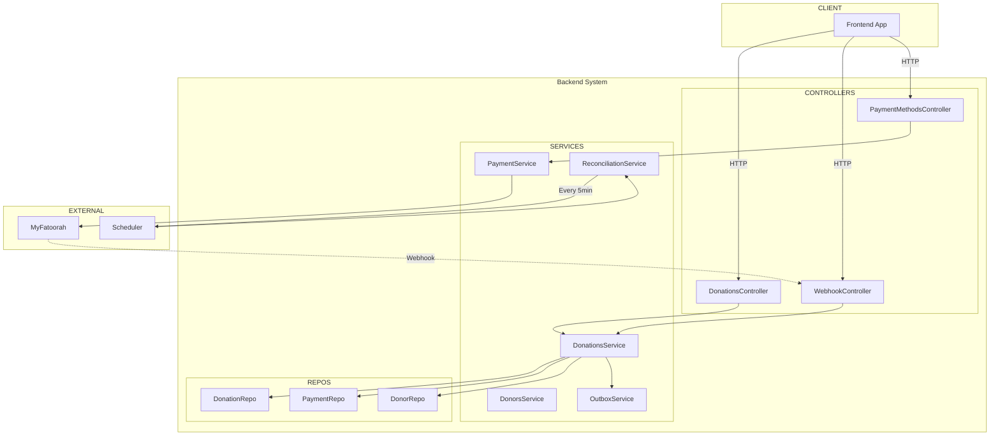

## 2.2 Data Flow Architecture

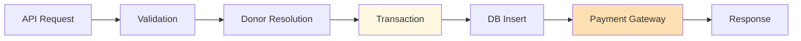

---

# 3. MIND MAP ARCHITECTURE

## 3.1 Complete System Mind Map

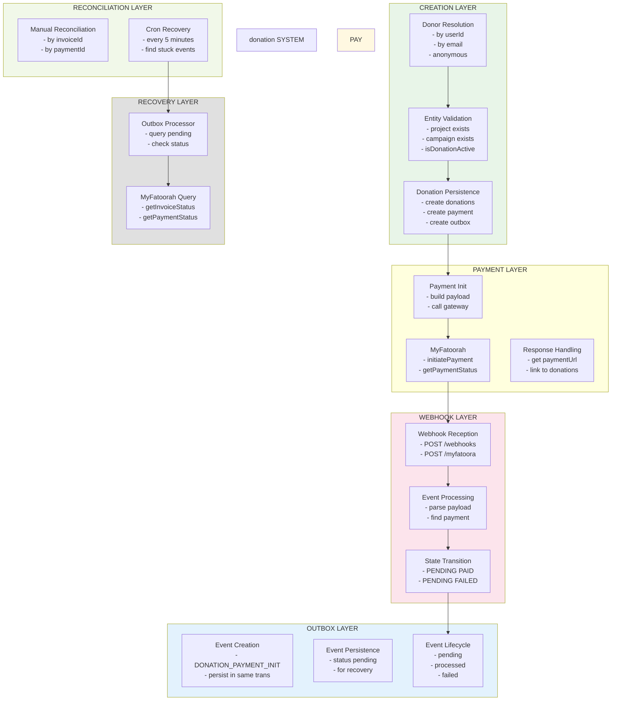

## 3.2 Component Relationships

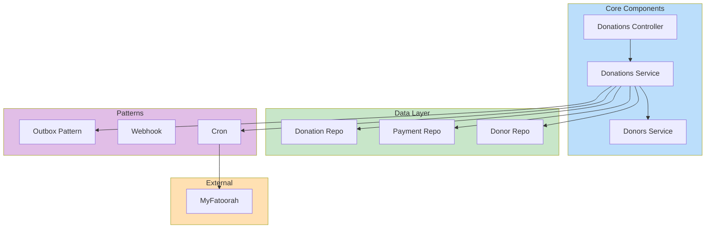

---

# 4. USER JOURNEY MODELS

## 4.A Registered User Donation Flow

### Complete Sequence Diagram

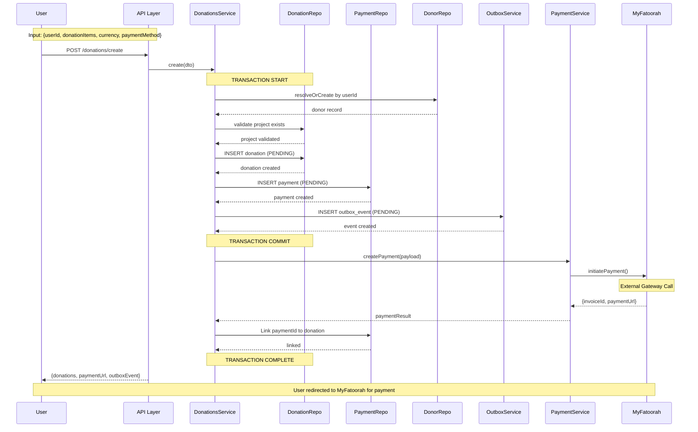

### Input Structure

```typescript
{
  currency: "KWD",
  paymentMethod: 1,
  donationItems: [{ amount: 100, projectId: "uuid" }],
  donorInfo: { userId: "uuid" }
}
```

### Database Operations

```sql
-- In single transaction:
SELECT * FROM donors WHERE userId = ?
INSERT INTO donations (status='pending') VALUES (?)
INSERT INTO payments (status='pending') VALUES (?)
INSERT INTO outbox_events (eventType='DONATION_PAYMENT_INIT') VALUES (?)
UPDATE donations SET paymentId = ? WHERE id = ?
```

---

## 4.B Guest User Donation Flow

### Sequence Diagram

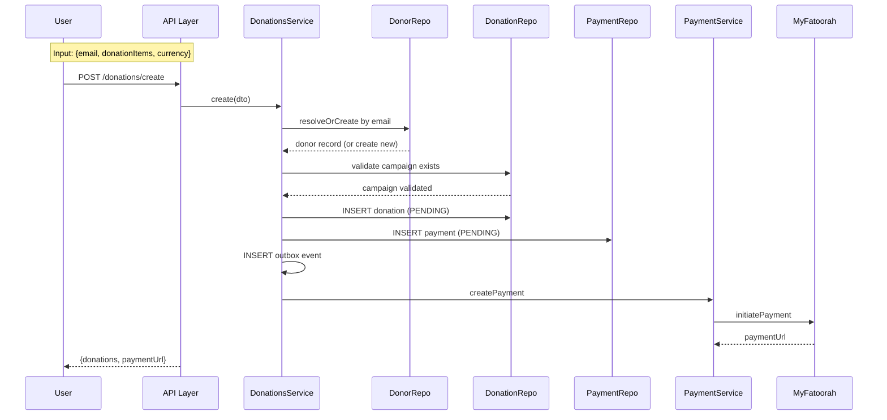

### Input Structure

```typescript
{
  currency: "KWD",
  paymentMethod: 1,
  donationItems: [{ amount: 50, campaignId: "uuid" }],
  donorInfo: {
    email: "guest@example.com",
    fullName: "Guest Name",
    isAnonymous: false
  }
}
```

---

## 4.C Anonymous Donation Flow

### Sequence Diagram

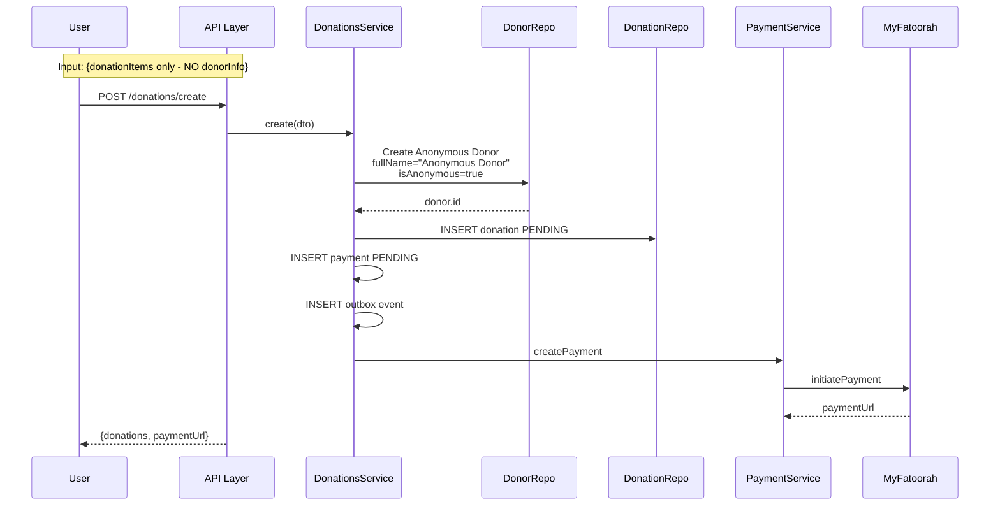

### Input Structure

```typescript
{
  currency: "KWD",
  paymentMethod: 1,
  donationItems: [{ amount: 10, projectId: "uuid" }]
  // NO donorInfo provided
}
```

---

# 5. External Payment Phase (المعاملات الخارجية)

## 5.1 ما الذي يحدث عندما يغادر المستخدم النظام؟

### المشكلة الأساسية

عندما يتم تحويل المستخدم إلى صفحة الدفع (MyFatoorah)، فإن النظام يصبح **لا يعرف شيئاً** عن ما يحدث.

```
┌─────────────────────────────────────────────────────────────────────────┐
│                    المراحل الثلاثة للتبرع                                   │
├─────────────────────────────────────────────────────────────────────────┤
│                                                                         │
│  المرحلة ١: داخل النظام                                              │
│  ┌─────────────────┐                                                  │
│  │ المستخدم يطلب │ ──► إنشاء التبرع ──► دفع المبلغ               │
│  │ التبرع          │      (pending)           (قيد الانتظار)           │
│  └─────────────────┘                                                  │
│         │                                                              │
│         ▼                                                              │
│         ==========================================================================
│                                                                         │
│  المرحلة ٢: خارج النظام (Black Box)                                   │
│  ┌─────────────────────────────────────────────────────────────────┐   │
│  │                                                                 │   │
│  │    ╔═══════════════════════════════════════╗                      │   │
│  │    ║      صفحة الدفع MyFatoorah          ║                      │   │
│  │    ║                                       ║                      │   │
│  │    ║  • إدخال بيانات البطاقة            ║                      │   │
│  │    ║  • الضغط على زر دفع                 ║                      │   │
│  │    ║  • انتظار النتيجة                   ║                      │   │
│  │    ║                                       ║                      │   │
│  │    ║  • ✓ نجح الدفع                      ║   ✓                 │   │
│  │    ║  • ✗ فشل الدفع                      ║   ✗                 │   │
│  │    ║  • ⊙ إغلاق الصفحة                  ║   ⊙                 │   │
│  │    ║  • ⊙ انقطع الإنترنت                ║   ⊙                 │   │
│  │    ╚═══════════════════════════════════════╝                      │   │
│  │                                                                 │   │
│  │        النظام لا يعرف شيئاً عن أي من هذه الاحتمالات!                │   │
│  │                                                                 │   │
│  └─────────────────────────────────────────────────────────────────┘   │
│         │                                                              │
│         ▼                                                              │
│         ==========================================================================
│                                                                         │
│  المرحلة ٣: العودة للنظام                                             │
│  ┌─────────────────┐     ┌─────────────────┐     ┌─────────────────┐  │
│  │عادة عبر       │     │عادة عبر        │     │عادة عبر        │  │
│  │Webhook          │     │Cron (جدول)      │     │الاستعلام       │  │
│  │(الإشعار)        │     │(كل ٥ دقائق)    │  │يدوي           │  │
│  └─────────────────┘     └─────────────────┘     └─────────────────┘  │
│                                                                         │
└─────────────────────────────────────────────────────────────────────────┘
```

## 5.2 الاحتمالات الستة عندما يكون المستخدم خارج النظام

| #   | Scenario           | What User Does      | Does System Know? | How to Find Out |
| --- | ------------------ | ------------------- | ----------------- | --------------- |
| 1   | **نجح PAYMENT**    | أكمل الدفع ونجح     | ❌ لا             | Webhook         |
| 2   | **فشل PAYMENT**    | رفضت البطاقة/خطأ    | ❌ لا             | Webhook أو Cron |
| 3   | **أغلق الصفحة**    | أغلق المتصفح        | ❌ لا             | Cron فقط        |
| 4   | **عدsans دون PAY** | ضغط رجوع عاد للصفحة | ❌ لا             | Cron فقط        |
| 5   | **انقطع الإنترنت** | انقطع الإنترنت      | ❌ لا             | Cron فقط        |
| 6   | **توقف المتصفح**   | تجمد المتصفح        | ❌ لا             | Cron فقط        |

### الملخص

> **النظام لا يعرف أي شيء عن حالة الدفع طالما المستخدم خارج النظام!**

الإحتمالات الوحيدة لمعرفة ما حدث:

1. **Webhook** - إذا أرسلت MyFatoorah إشعار للنظام (ليس مضمون!)
2. **Cron** - إذا جاء وقت الفحص الدوري (كل ٥ دقائق)
3. **استعلام يدوي** - إذا طلب المستخدم أو الأدمن معرفة الحالة

---

## 5.3 كيفية عمل النظام لمعرفة حالة الدفع

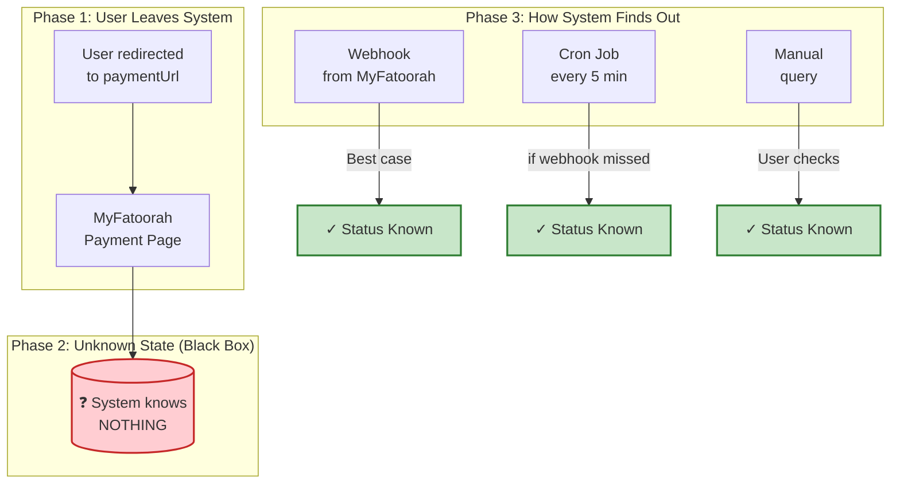

### 5.3.1 الطريقة الأولى: Webhook (الإشعار من MyFatoorah)

```
السيناريو المثالي:

١. المستخدم يكمل الدفع في صفحة MyFatoorah
٢. MyFatoorah ترسل webhook للنظام
٣. النظام يحدث حالة التبرع
٤. كل شيء تمام!


المشكلة:
- MyFatoorah لا ترسل webhook دائماً
- قد يرسل webhook بعد ساعات
- أو قد لا يرسل إطلاقاً!
```

### 5.3.2 الطريقة الثانية: Cron Job (الفحص الدوري)

```
ماذا يفعل Cron كل ٥ دقائق؟

١. يبحث عن جميع التبرعات في حالة "pending"
٢. يسأل MyFatoorah عن حالة كل واحد
٣. إذا تغيرت الحالة، يحدثها في النظام
٤. إذا مر وقت طويل (مثلاً ٢٤ ساعة)، يحددها كفاشلة


الجدول الزمني:

┌──────────────────────────────────────────────────────────────┐
│ وقت الإنشاء    │ ٠      │ ٥     │ ١٠    │ ١٥    │ ٢٠    │
├──────────────────────────────────────────────────────────────┤
│pending        │pending │pending│paid(?) │paid   │paid   │
└──────────────────────────────────────────────────────────────┘
                 ▲      ▲      ▲      ▲      ▲
                 │      │      │      │      └─ Cron discovers
                 │      │      │      └──────── Webhook arrives
                 │      │      └─────────────── Cron checks (status unknown)
                 │      └─────────────────────── Cron checks (status unknown)
                 └────────────────────────── User still on payment page
```

### 5.3.3 الطريقة الثالثة: الاستعلام اليدوي

```
كيف يستطيع المستخدم أو الأدمن معرفة الحالة؟

المستخدم:
- يزور صفحة /invoice/payment/{paymentId}
- أو صفحة /invoice/{invoiceId}

الأدمن:
- يستعلم من لوحة التحكم
- أو يستخدمCron يدوي
```

---

## 5.4 حالة eventual Consistency (الاتساق النهائي)

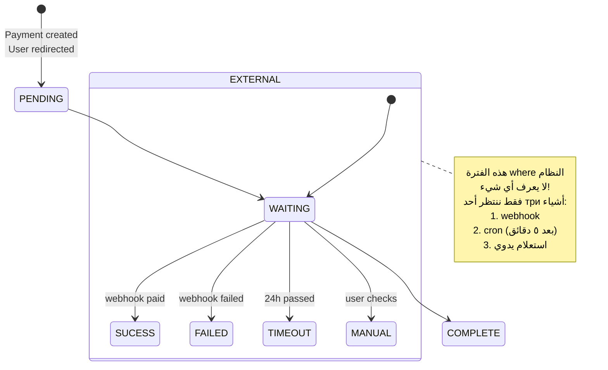

### شرح states:

| State        | Meaning                                | When                           |
| ------------ | -------------------------------------- | ------------------------------ |
| **Pending**  | التبرع تم إنشاؤه لكن الدفع لم يتم بعد  | After `POST /donations/create` |
| **Waiting**  | المستخدم على صفحةPaiement, النظام يبحث | User on MyFatoorah page        |
| **Complete** | تم معرفة حالة الدفع                    | webhook/cron/manual            |
| **Timeout**  | مر ٢٤ ساعة بدون علم                    | After 24h                      |

---

## 5.5 Black Box Phase Diagram (مخطط fase الصندوق الأسود)

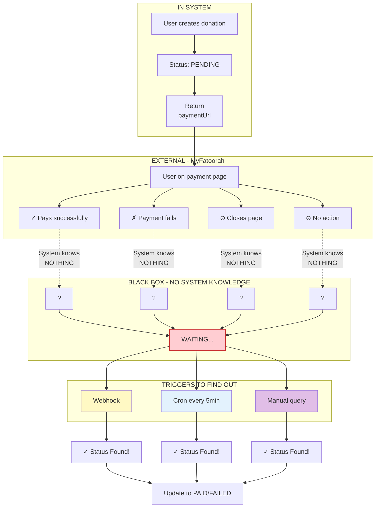

---

## 5.6 Possible Outcomes Table

| #   | Scenario                   | User Action         | System Detection  | Recovery Method    |
| --- | -------------------------- | ------------------- | ----------------- | ------------------ |
| 1   | **Payment Success**        | Completes payment   | webhook (or cron) | Auto by webhook    |
| 2   | **Payment Failed**         | Card declined       | webhook (or cron) | Auto by webhook    |
| 3   | **Closes Browser**         | Closes tab/page     | **NONE**          | Cron timeout       |
| 4   | **Returns Without Paying** | Goes back           | **NONE**          | Cron timeout       |
| 5   | **Network Interruption**   | Connection lost     | **NONE**          | Cron timeout       |
| 6   | **No Action**              | Leaves payment page | **NONE**          | Cron timeout (24h) |

---

## 5.7 Eventual Consistency Model

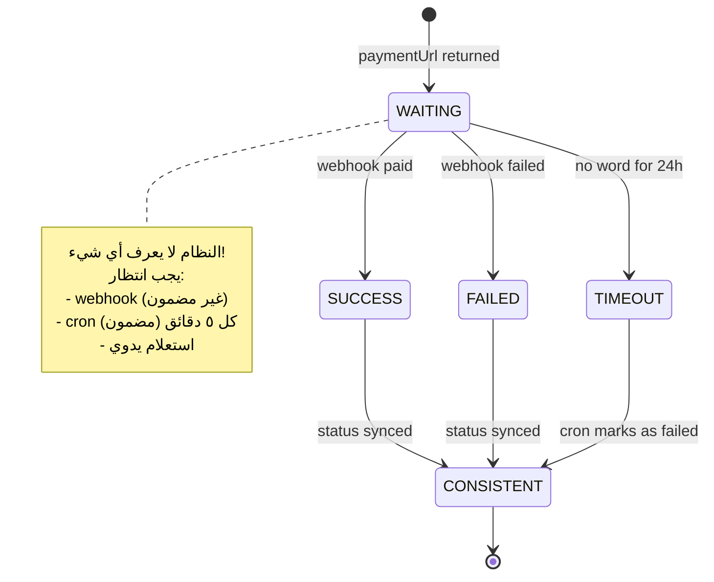

---

## 5.8 Summary for Non-Programmers

### ما الذي يحدث بشكل بسيط:

```
١. المستخدم ينشئ تبرع
   ↓
٢. يتحول لصفحة الدفع (MyFatoorah)
   ↓
٣. ►►►►►►►►►►►►►►►►►►►►►►►►►►►►►►►►►►
      هنا النظام لا يعرف أي شيء!
   ►►►►►►►►►►►►►►►►►►►►►►►►►►►►►►►►►►►
   ↓
٤. واحد من trois أشياء يحدث:

   أ) MyFatoorah ترسل webhook للنظام
      → النظام يعرف الحالة ✓

   ب) Cron يفحص كل ٥ دقائق
      → النظام يعرف الحالة ✓

   ج) المستخدم يستعلم يدوي
      → النظام يعرف الحالة ✓
```

### لماذا هذا مهم؟

- **لا تحذف التبرع من قاعدة البيانات مباشرة** - قد يكون الدفع pending!
- **انتظر ساعة على الأقل** قبل اعتبار التبرع فاشل
- **Cron يعمل كل ٥ دقائق** - سيكتشف eventually
- **Webhook ليس مضموناً** - لا تعتمد عليه فقط

---

# 6. WEBHOOK RECONCILIATION ENGINE

## 6.1 Processing Flow

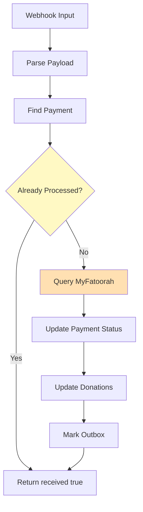

## 6.2 Idempotency Logic

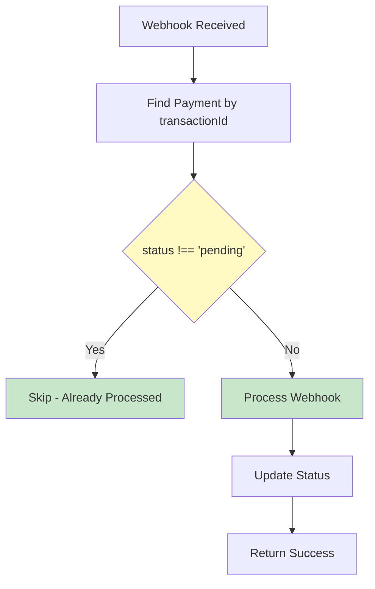

---

# 7. OUTBOX PATTERN BEHAVIOR

## 7.1 Event Creation Flow

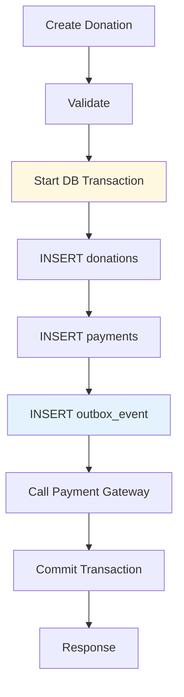

## 7.2 Event Lifecycle States

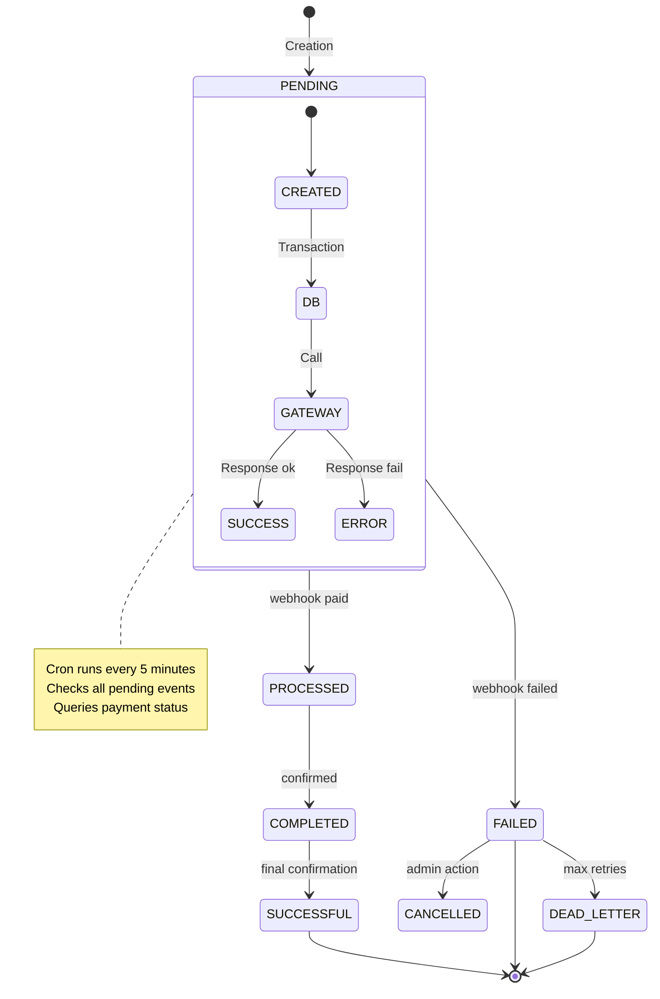

## 7.3 Cron Processor Flow

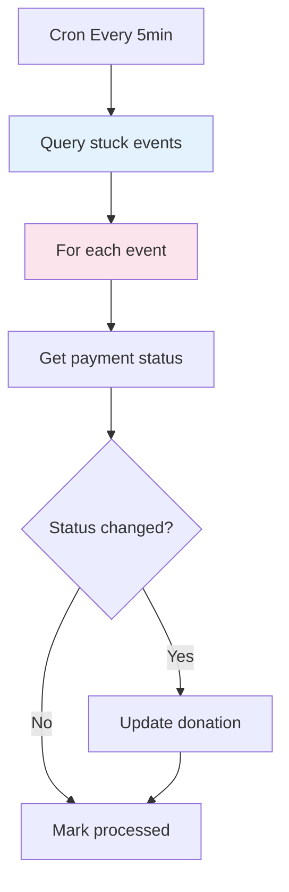

---

# 8. STATE MACHINE MODEL

## 8.1 Donation State Diagram

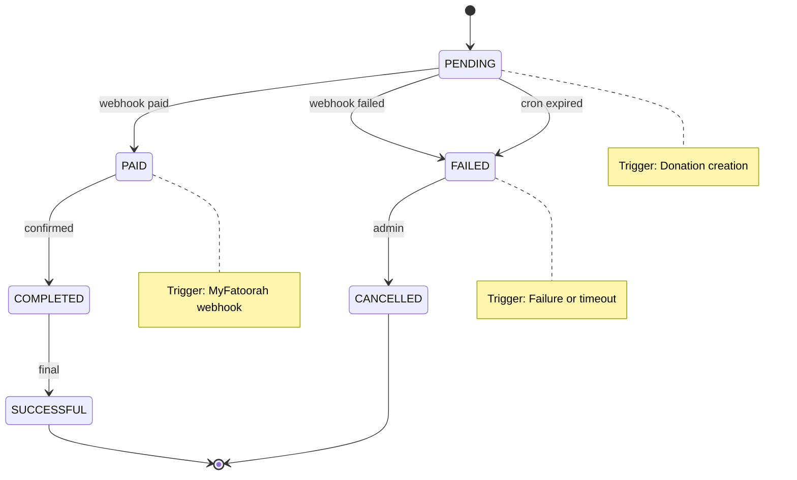

## 8.2 Valid Transitions

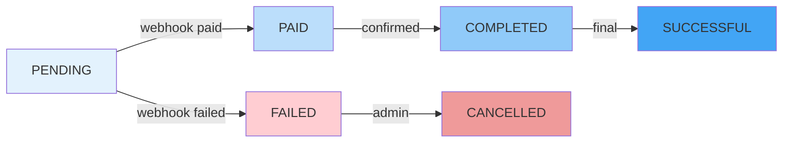

## 8.3 Invalid Transitions (Rejected)

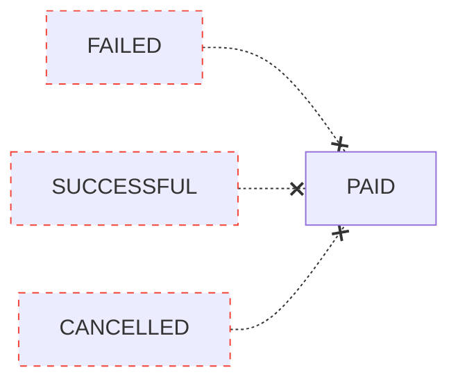

---

# 9. API FLOWS

## 9.A POST /donations/create

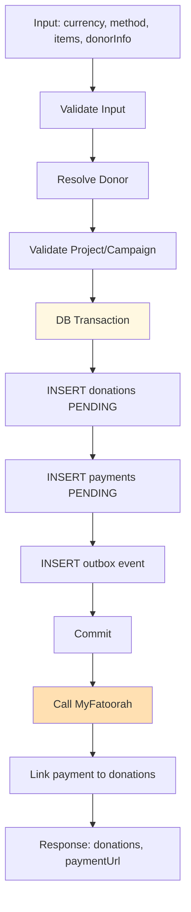

## 9.B POST /payments/webhook

```mermaid
graph TD
    SUB1[Webhook Payload]
    S1[Parse]
    S2[Find Payment]
    S3{Idempotent?}
    S4[Query MyFatoorah]
    S5[Update Payment Status]
    S6[Update Donations Status]
    S7[Mark Outbox Processed]
    OUT[Return received true]

    SUB1 --> S1
    S1 --> S2
    S2 --> S3
    S3 -->|"No"| S4
    S3 -->|"Yes"| OUT
    S4 --> S5
    S5 --> S6
    S6 --> S7
    S7 --> OUT

    style S3 fill:#fff9c4
```

## 9.C GET /donations/payment-status

```mermaid
graph TD
    INPUT[key, type]
    FIND[Find Payment]
    CHECK{Found?}
    QUERY[Query MyFatoorah]
    UPDATE[Update Status]
    FORMAT[Format Response]
    OUT[Return detailed]

    INPUT --> FIND
    FIND --> CHECK
    CHECK -->|"Yes"| FORMAT
    CHECK -->|"No"| QUERY
    QUERY --> UPDATE
    UPDATE --> FORMAT
    FORMAT --> OUT
```

---

# 10. DATABASE RELATIONSHIPS

## 10.1 Entity Relationship Diagram

```mermaid
graph TD
    D[donations]
    P[payments]
    DO[donors]
    PJ[projects]
    C[campaigns]
    U[users]

    D -->|"FK"| P
    D -->|"FK"| DO
    D -->|"FK"| PJ
    D -->|"FK"| C
    DO -->|"FK"| U

    style D fill:#e3f2fd
    style P fill:#bbdefb
    style DO fill:#c8e6c9
```

## 10.2 FK Dependencies

```mermaid
graph LR
    D[donations.id]
    DO[donors.id]
    P[payments.id]
    PJ[projects.id]
    C[campaigns.id]
    U[users.id]

    D --> DO
    D --> P
    D --> PJ
    D --> C

    DO --> U

    style D fill:#e3f2fd
    style DO fill:#bbdefb
    style P fill:#90caf9
```

---

# 11. SUMMARY

## System Summary

| Component          | Status | Implementation                    |
| ------------------ | ------ | --------------------------------- |
| Donation Creation  | Active | DonationsService.create()         |
| Donor Resolution   | Active | DonorsService.resolveOrCreate()   |
| Payment Gateway    | Active | MyFatoorah only                   |
| Outbox Pattern     | Active | OutboxService + Cron              |
| Webhook Processing | Active | handlePaymentWebhook()            |
| Reconciliation     | Active | Manual + Cron                     |
| Status Tracking    | Active | PENDING PAID COMPLETED SUCCESSFUL |

## Key Behaviors

1. **Transaction-wrapped donation creation** - All in single DB transaction
2. **Outbox crash recovery** - Event persists for gateway failures
3. **Idempotent webhooks** - Duplicate webhooks are ignored
4. **Atomic increments** - currentAmount/donationCount updated atomically
5. **Black box payment** - User leaves system, no direct awareness
6. **Eventual consistency** - Via webhook or cron (5 min)

## Known Workflows

- User creates donation -> Donation created PENDING
- User redirected to paymentUrl -> MyFatoorah handles payment
- MyFatoorah sends webhook -> Status updated to PAID/COMPLETED
- Or: Cron runs 5min -> Stuck donations reconciled
